# Bài thực hành: Lập trình Python với MQTT

## Broker sử dụng
- **Họ và tên**: `Đặng Minh Hiếu`  
- **MSV**: `B21DCAT087`

## Broker sử dụng
- **Broker**: `broker.emqx.io`  
- **Port**: `1883`

---

## Cài đặt thư viện

```bash
pip install paho-mqtt
```

---

## Cách chạy từng chương trình

### Bài 1 – Gửi và nhận thông điệp cơ bản

#### Folder Bai_1
Chạy 2 Terminal:

**Terminal 1 – Subscriber:**
```bash
python subscriber.py
```

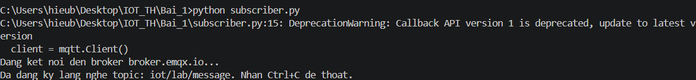

**Terminal 2 – Publisher:**
```bash
python publisher_bai1.py
```

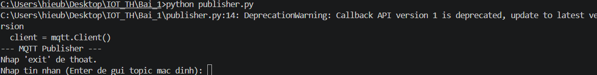

**KẾT QUẢ**

**Publisher:** (Có thể gửi nhiều lần)

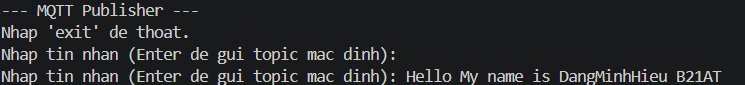

**Subscriber:** (Nhận được nhiều tin nhắn gửi qua từ Publisher)


**Subscriber:** (Dừng chương trình bằng Ctrl + C)

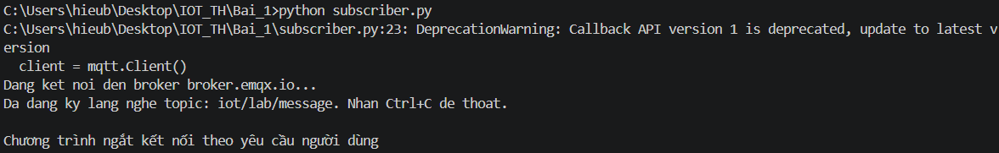

---


### Bài 2 – Mô phỏng cảm biến nhiệt độ & độ ẩm

Chạy 2 terminal:

**Terminal 1 – Monitor Subscriber:**
```bash
python monitor_subscriber.py
```

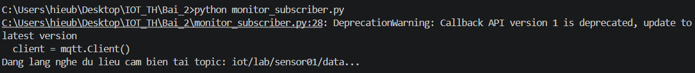

**Terminal 2 – Sensor Publisher:**
```bash
python sensor_publisher.py
```

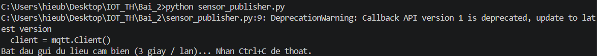

**KẾT QUẢ**

**Sensor Publisher:** (Hướng 1 Sensor)

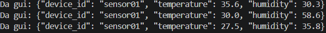

**Monitor Subscriber:** (Có cảnh báo nhiệt độ cao, độ ẩm thấp)

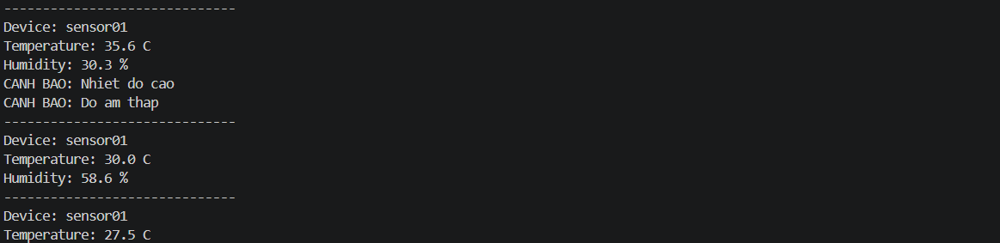

---

### Bài 3 – Hệ thống điều khiển đèn thông minh

Chạy 2 Terminal:

**Terminal 1 – Smart Light Device:**
```bash
python device.py
```

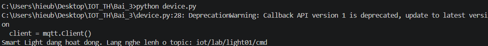

**Terminal 2 – Controller App:**
```bash
python controller.py
```

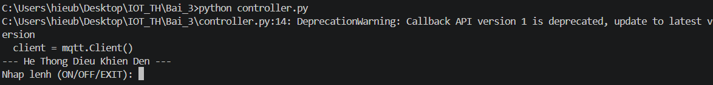

Nhập lệnh vào Terminal Controller:
- `ON` — bật đèn / `OFF` — tắt đèn

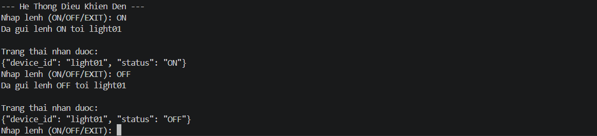

Kết quả hiển thị Terminal Device

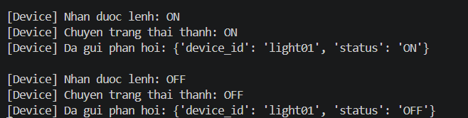

- Nhập khác `ON` / `OFF`
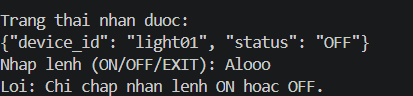

- `EXIT` — Thoát chương trình

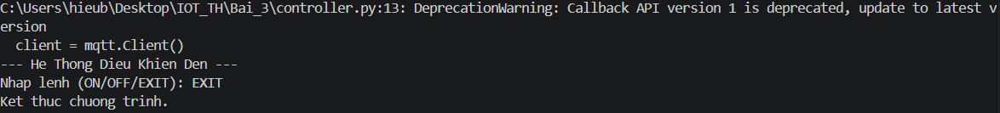

---

